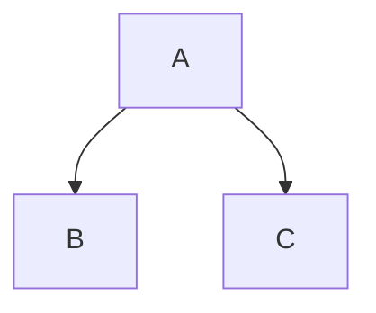
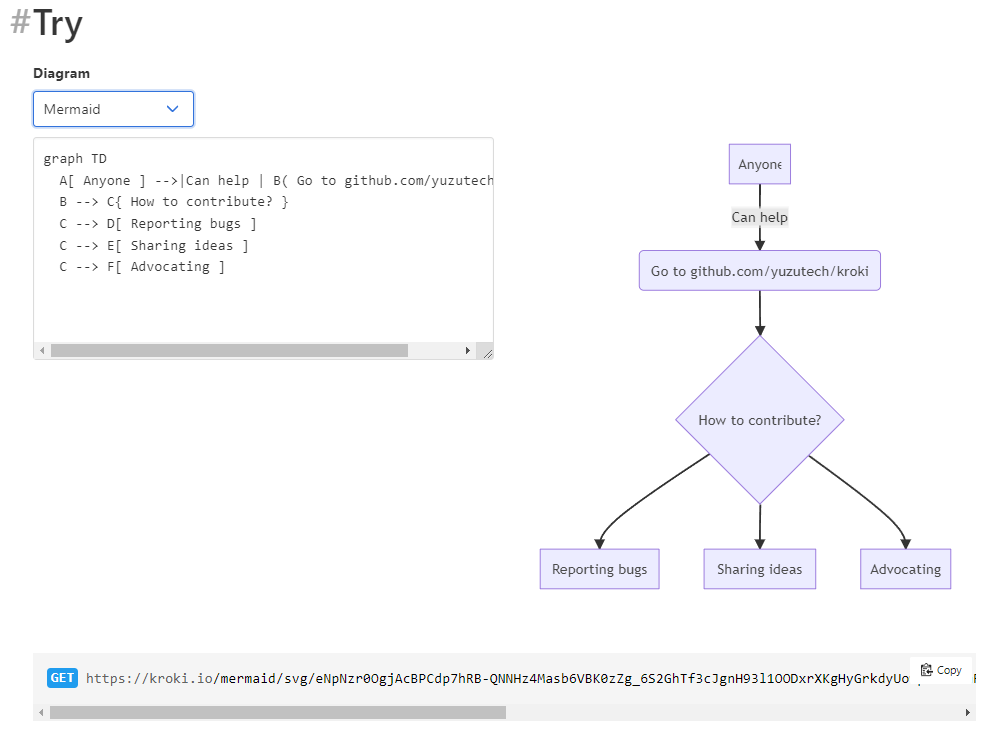
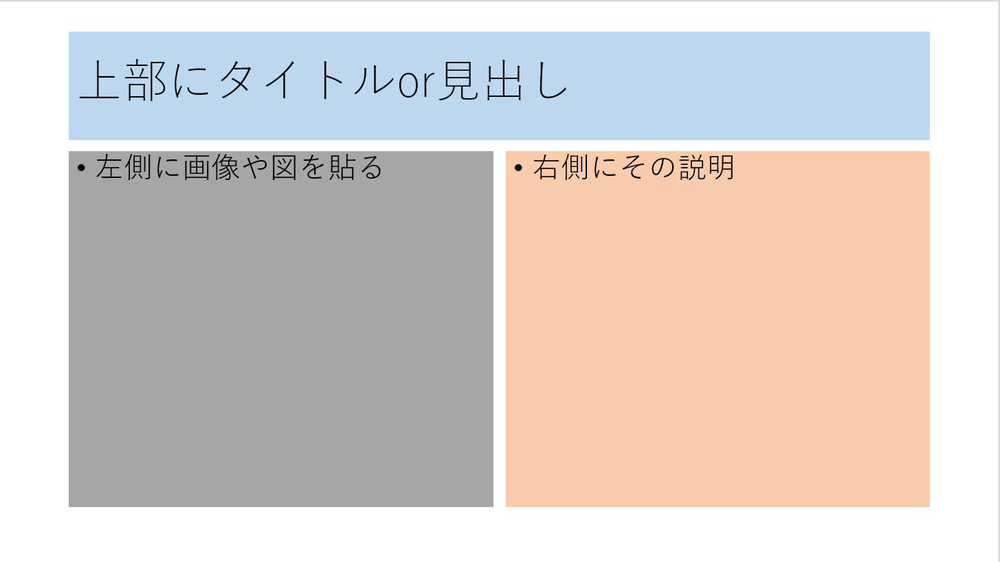

# Marpで簡単にスライド作成


### 2022-5-7 ELICXIR
<!--
_class: lead

_header: ""
-->


---
### 目次
- Marpとは？
- Marpの利用方法
- Marpに図形を添付する
- CSSの利用
- Marpの出力について
- まとめ
- 参考資料

---
### Marpとは？
Marp(marpit)はYuki Hattori氏により作成されているオープンソースのスライド作成ツール。

https://github.com/marp-team/marpit

Markdown形式のドキュメントからプレゼンテーション用のスライドを作成できる。
(もちろんこのスライドもMarp製)

CLIやVScodeの拡張機能として提供されている。
今回はVScode版を使用。


---
### Marpの利用方法
VScodeの拡張機能で Marp for VS code を導入

Markdown形式のファイルを作成し、冒頭に
```
---
marp: true
---
```
と宣言。


---
### Marpの利用方法
Markdownの記法が使える

→見出しやコードブロック、箇条書きなどで簡単にスライドの
　体裁を整えられるので便利

```
---
```
によりスライドのページ分割が可能

<!--
コードブロックとシンタックスハイライトについても言及する
-->


---

### Marpの利用方法
非常に便利なコメント機能が実装されている。

以下のようなコメントの記法を用いると、
```
<!--
ここにコメントを書く
-->
```
発表者モードでコメントとして表示されるため便利。

---


### Marpの利用方法

このスライドを作成している際の作業風景を紹介

左で編集し右で確認するという形式で
完成形を把握しつつ
スライドを作成することができる。


---
### Marpに図形を添付する

体裁の整った図形を生成するには
テキストから図を生成するエンジンを用いるのが簡便

例えば？

* PlantUML
* mermaid.js


<!--
* PlantUML
UMLをテキストから生成
統一モデリング言語 Unified Modeling Language
ソフトウェア設計においてよく用いられる

* mermaid.js
テキストからグラフを自動で作成してくれるライブラリ
今年のバレンタインデーにgithubに対応したことでも有名
VS code + Markdown Preview Enhanced の組み合わせが非常に便利なのでこれでかけると最高。

しかし、スライドで利用するには少し癖がある。
コードブロックで記述する方式ではうまくいかない。
-->
---
以下のようなコードブロックがそのまま認識されれば最高！
````

````

しかし現実は非情である。　どうすればいい？

---
### Marpに図形を添付する

mermaid.jsをhtmlでスライドに埋め込んでみる

<div class="mermaid">
graph TD;
    A-->B;
    A-->C;

</div>

<script src="https://unpkg.com/mermaid@8.1.0/dist/mermaid.min.js"></script>
<script>mermaid.initialize({startOnLoad:true});</script>

ただし、非常に記述が面倒

上の図形を実現するための記述は？

---
### Marpに図形を添付する
``` js
<div class="mermaid">
graph TD;
    A-->B;
    A-->C;
</div>

<script src="https://unpkg.com/mermaid@8.1.0/dist/mermaid.min.js"></script>
<script>mermaid.initialize({startOnLoad:true});</script>
```

あんまりスマートではないね…

---
### Marpに図形を添付する
解決策として…

1) draw.ioなどで画像を生成し画像の形で埋め込む
2) kroki.ioなどの外部描画機能を使う。


---
### Marpに図形を添付する
解決策として…

1. draw.ioなどで画像を生成し画像の形で埋め込む
2. kroki.ioなどの外部描画機能を使う。

1については特筆することもないので省略
2の手法について解説。

2には慣れが必要ですが慣れると便利。

---
### Marpに図形を添付する
kroki.ioを利用するには？
https://kroki.io/
ここにアクセス。


Tryの欄で使う言語を指定し、記述すると右側に結果が生成される。

下のURLをコピーして貼り付けると…

---
### Marpに図形を添付する


スライドに図が添付される

利点
* 画像ファイルの管理が不要

欠点
* krokiの描画バグ？がある
* 閲覧時にネット環境が必要
<!--
anyoneが若干切れていることに言及
PlantUMLをkrokiで貼り付けるとうまくいくことが多いことにも言及
-->
---
### CSSの利用

htmlタグを埋め込むことができるのでそこにstyleでcssを付与してあげれば様々な配置、スタイルを実現可能

(htmlを設定で有効化する必要あり)

<div style="display: flex;justify-content:left;">

<p style="margin:20px">
例として左のような<br>スライドを作成してみよう<br>
</p>
</div>

---
<h3 style="background-color:gray;color:white">CSSの利用</h3>

<div style="display: flex;justify-content:center;margin-top:20px">

<p style="margin-top:0;margin-left:20px;background-color:gray;color:white;">
cssにより、左右分割のスタイルを実現可能。<br>
背景等にもcssを作用させて、それをテンプレート化することもできるが、それはさらに複雑なので今回は省略<br>
<br>
<br>
ではこのページのソースを見てみよう

</p>

</div>

---
### CSSの利用
```
<h3 style="background-color:gray;color:white">CSSの利用</h3>

<div style="display: flex;justify-content:center;margin-top:20px">


<p style="margin-top:0;margin-left:20px;background-color:gray;color:white;">
cssにより、左右分割のスタイルを実現可能。<br>
背景等にもcssを作用させて、それをテンプレート化することもできるが、それはさらに複雑なので今回は省略<br>
<br>
<br>
ではこのページのソースを見てみよう

</p>

</div>
```
---
### CSSの利用
本質的な部分だけ抜き出すと
```
<h3>スライドタイトル</h3>

<div style="display: flex;justify-content:center; text-align: left;margin-top:20px">

  <div style="margin-top:0;">
  要素1(左側)
  </div>

  <div style="margin-top:0;margin-left:20px;">
  要素2(右側)
  </div>

</div>
```
---

### CSSの利用
* 書式は一般的なCSSをそのまま使用可能
  * style=""の形でhtmlタグに記述することでCSSを適用
* display:flexにより並べて配置することが可能
* 適当にmarginを設定して体裁を整える
<br>

* displayとjustify-contentとmargin,paddingを理解していれば<br>たいていの配置を実現できる
---
### CSSの利用

htmlのimgはweb上からもソースをとってこれるので、
先に述べたkroki.ioとの相性が非常によい。

```

```
sourceの部分にkroki.ioで生成したurlを貼ると簡単に分割した領域に画像を貼り付けることができる。
画像の大きさはCSSのwidthやheightで大きさを調整するのが良い。

---
## Marpの出力について
以下の出力形式に対応している
* pdf
* pptx(パワーポイント)
* html
  * パワーポイントと同様の形式のhtmlファイルが生成される。 
* png jpeg
  * first slide only なのであくまでサムネイル用？ 
<!--
パワーポイント形式(pptx)で出力する際には注意が必要
試しに出力してみたところパワポ側では文字や画像がオブジェクト扱いされていなかった。(あくまで画像として生成されている)
→Marpで概形を作成しそれをパワポに出力してそちらで微調整するといったことはできなさそう。

htmlがよい
-->

---
## Marpの出力について
個人的おすすめは？
* html
---
## Marpの出力について
個人的おすすめは？
- html

なんで？
* gifやmp4の再生に対応
* ブラウザで環境を選ばず簡単に開ける
* html出力のパワーポイントの使い勝手のよさ
<!--
ボタン一つで発表モード+時間管理が可能+コメントも本家と同様の機能
-->

---
## まとめ

* MarpでMarkdownから簡単にスライドを生成可能
* 画像、図形の埋め込みも可能
  * 図形の埋め込みにはkroki.ioが便利
  * 配置には若干コツが要求される
* cssを用いたスタイル調整も可能
* html,pptx,pdfなどで出力可能
  * 中でもhtmlがおすすめ
---
## まとめ

- MarpでMarkdownから簡単にスライドを生成可能
- 画像、図形の埋め込みも可能
  - 図形の埋め込みにはkroki.ioが便利
  - 配置には若干コツが要求される
- cssを用いたスタイル調整も可能
- html,pptx,pdfなどで出力可能
  - 中でもhtmlがおすすめ

⇒Marpを使うと簡単に一定クオリティのスライドを生成可能

---
## 参考資料
本家github
https://github.com/marp-team/marpit

Marp(Markdown Presentaiton)の文法まとめ
https://qiita.com/pocket8137/items/27ede821e59c12a1b222

Marpを使ってmarkdownでスライド資料を作成する
https://dev.classmethod.jp/articles/make-slides-from-markdown-with-marp/